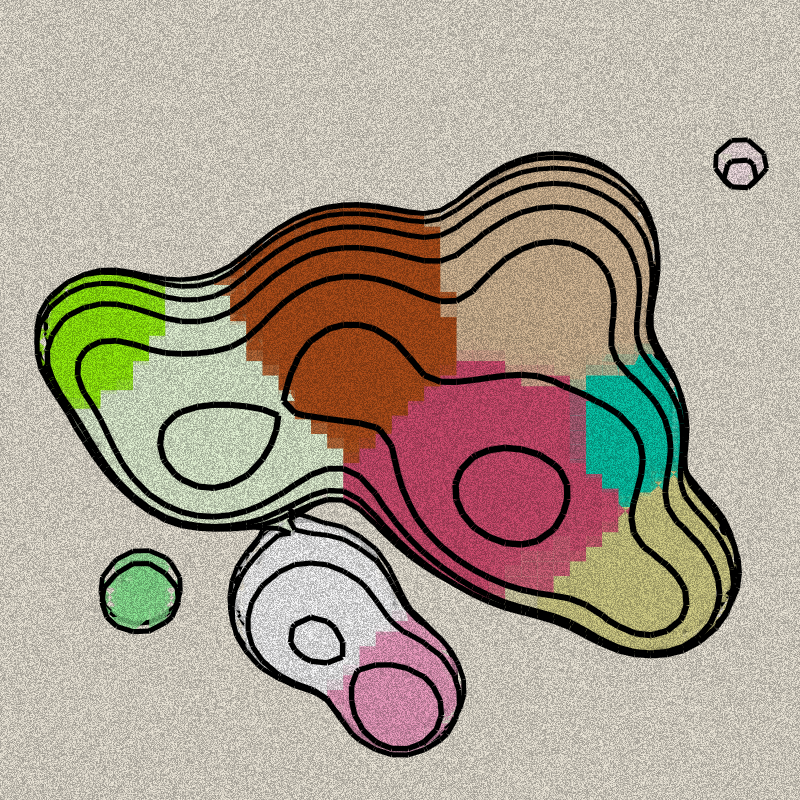

# Curious Contours

A procedural terrain generator that creates contour-style landscapes in real-time using 3D metaballs and marching squares algorithm.

##Live demo: [https://collidingscopes.github.io/curious-contours/](https://collidingscopes.github.io/curious-contours/)

## Features

- Generate unique procedural terrain textures in real-time
- Customize animation speed, complexity, colors, and more
- Export your creations as images or videos
- Completely free and open source (MIT license)

## How it Works

Curious Contours uses 3D spheres (metaballs) that float around and combine with others based on distance. 2D cross-sections are drawn using a Marching Squares algorithm, producing a terrain contour aesthetic.

## Usage

- Use the controls to adjust settings
- Click the randomize button (🎲) for new variations
- Save your creations as images (📷) or videos (🎥)

## Tech Stack

- Vanilla JavaScript
- HTML5 Canvas
- dat.GUI for controls
- mp4-muxer for video export

## Contributing

Contributions are welcome! Feel free to submit issues or pull requests.

## License

This project is open source and licensed under the MIT License

## Related Projects

Check out my other free and open-source projects:

- [Liquid Shape Distortions](https://collidingScopes.github.io/liquid-shape-distortions) - psychedelic animations created with webgl shaders
- [Particular Drift](https://collidingScopes.github.io/particular-drift) - Turn photos into flowing particle animations
- [Liquid Logo](https://collidingScopes.github.io/liquid-logo) - Transform logos and icons into liquid metal animations
- [Video-to-ASCII](https://collidingScopes.github.io/ascii) - Convert videos into ASCII pixel art
- [Shape Shimmer](https://collidingScopes.github.io/shimmer) - Turn photos into funky wave animations
- [Colliding Scopes](https://collidingScopes.github.io) - Turn photos into kaleidoscope animations

## Connect with the Developer

- Instagram: [@stereo.drift](https://www.instagram.com/stereo.drift/)
- Twitter/X: [@measure_plan](https://x.com/measure_plan)
- Email: [stereodriftvisuals@gmail.com](mailto:stereodriftvisuals@gmail.com)
- GitHub: [collidingScopes](https://github.com/collidingScopes)

## Donations

If you found this tool useful, feel free to buy me a coffee. 

My name is Alan, and I enjoy building open source software for art, animation, games, and more. This would be much appreciated during late-night coding sessions!

